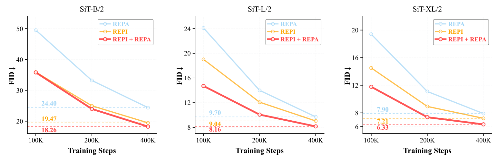

# Scaffold Then Internalize: Representation Injection for Diffusion Transformers

**Han Fu, Jiacheng Chen, Baoquan Zhao, Weidong Chen, Wei Liu, Li Qing, Xudong Mao**

[Project Page](https://jeneveuxpas.github.io/REPI/)

> **Code coming soon.** This repository is under preparation. The implementation has not been released yet.



## Overview

Recent representation alignment (REPA) methods accelerate diffusion transformer training by aligning projections of the transformer's hidden states with representations from pretrained visual encoders. In this work, we explore a reverse and complementary direction to REPA: rather than projecting diffusion representations into the encoder's space, we inject encoder representations into the diffusion transformer, allowing them to actively participate in the denoising process. To this end, we introduce REPresentation Injection (REPI), a training framework based on a scaffold-to-internalization strategy, in which projected encoder representations initially serve as a temporary scaffold and are then progressively internalized by the diffusion transformer. REPI not only outperforms REPA across a wide range of backbones but is also highly complementary to it, and combining the two yields substantial gains over either alone. Notably, with only 160K training steps, REPI + REPA surpasses vanilla SiT trained for 7M steps, a speedup of over 43.5×.

## Highlights

- **Complementary to REPA.** At 100K steps, combining REPI with REPA achieves an FID of 11.78, outperforming REPI (14.51) and REPA (19.40) alone.
- **160K vs. 7M.** REPI + REPA reaches an FID of 8.22 in just 160K training steps, matching vanilla SiT trained for 7M steps (FID 8.30), a speedup of over 43.5×.
- **Original Backbone.** The encoder and projection layers are used only during training and are fully discarded at inference, leaving the original backbone unchanged and incurring zero additional inference cost.

## Method

REPI follows two training stages: a temporary representation scaffold followed by internalization.

### 1. Scaffold: early training

Projected encoder keys and values temporarily replace the model's native K/V. Native queries preserve the connection to the noisy input.

### 2. Internalization: subsequent training

The model resumes computing its own K/V. An internalization objective aligns these native representations with the projected encoder targets.

### 3. Inference

At inference, the visual encoder and projection layers are removed. Sampling uses the original diffusion backbone, with no additional inference cost.

## Repository Status

**Code coming soon.** This repository currently contains the paper overview and method figures only.

## Citation

```bibtex
@misc{fu2026scaffold,
  title  = {Scaffold Then Internalize: Representation Injection for Diffusion Transformers},
  author = {Han Fu and Jiacheng Chen and Baoquan Zhao and Weidong Chen and Wei Liu and Li Qing and Xudong Mao},
  year   = {2026}
}
```
